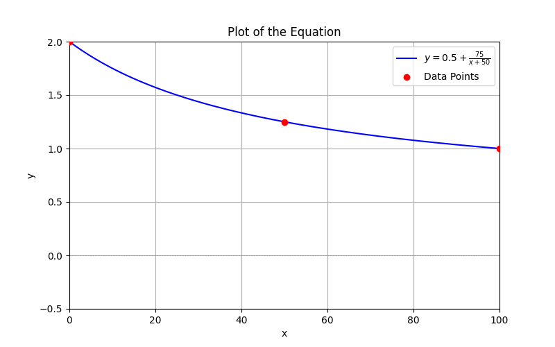

# Introduction

Content  
this is how you make citations: MedMamba[@yue2024medmamba]  
the yue2024medmamba part must be an id in references in frontmatter block above 

# Problem description 
Content

# Data Description
Content

# Preprocessing
Content

# Base model description 
Content   
then inline formula:   $l/2 Hz$ 

Embedding images:  

big formula, will be centered on page:

$$\arg\min_{G_\theta} \|v_k - G(z_k, k, \mathcal{F}_{\text{enc}}(X_l); \theta)\|_2^2$$

another formula example:

$$v_t = \sqrt{\bar{\alpha}_t} \epsilon - \sqrt{1 - \bar{\alpha}_t} x_0$$

To put greek letters in text, just use inline formula : $\epsilon$ and $x_0$. 

# Rejection model description 
Content

# Model parameters and how it's trained
Content

# Experiments
Content

# Results
Content  
a markdown table: 

| Model      |     LSD    | 
|------------|------------|
| GT-Mel     |  0.61      | 
| Unprocessed| 1.99-4.25  | 
| NVSR-DNN   | 1.13- 1.67 | 
| NVSR-ResUNet | 1.7- 0.95| 
| AUDIOSR    | 0.99- 0.73|
| AUDIOSR + Noise (our model) | 2 - 1.2| 

# Conclusion
Content

# References

::: {#refs}
:::